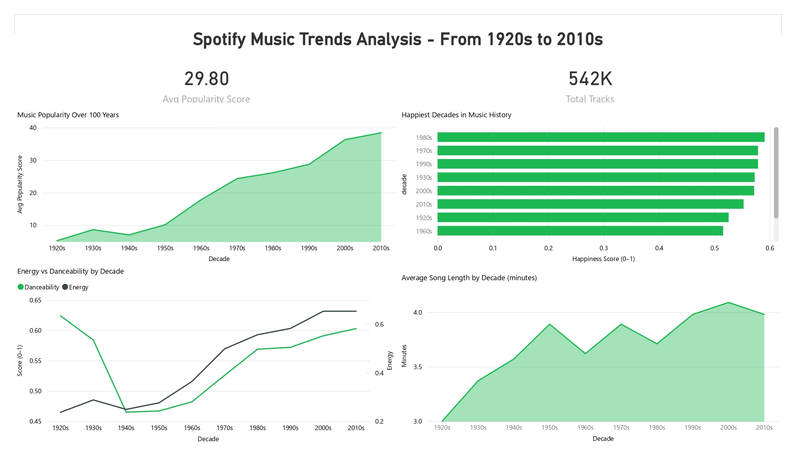

# Spotify Music Trends Analysis — 1920s to 2010s

**Tools:** Excel · SQL (SQLite) · Power BI  
**Dataset:** Spotify 600K+ Tracks by yamaerenay (Kaggle)  
**Tracks Analyzed:** 541,982  
**Status:** Completed ✅

---

## Overview

Analysis of over 540,000 Spotify tracks spanning 90 years of music 
history (1920s–2010s). This project explores how music has evolved 
in popularity, energy, danceability, and song length across decades — 
and identifies what audio features define a hit song on Spotify today.

---

## Dashboard Preview

---

## Business Questions Answered

1. Which songs are the most popular on Spotify right now?
2. How has music popularity changed decade by decade?
3. How have energy and danceability evolved over 90 years?
4. Are explicit tracks more popular than clean tracks?
5. Which artists have produced the most tracks?
6. What audio features do popular songs share?
7. How has average song length changed over time?
8. Which decades produced the happiest sounding music?

---

## Key Findings

- **Peaches** by Justin Bieber ft. Daniel Caesar & Giveon 
  is the #1 most popular track with a perfect score of 100
- **Explicit tracks** average 46.7 popularity vs 29.0 for clean 
  tracks — 61% higher engagement on Spotify
- **The most popular songs** (score 80–100) are shorter on average 
  (3.45 min) and significantly more danceable (0.672) than 
  low popularity tracks (0.552)
- **Music popularity has nearly tripled** from 1920s to 2010s, 
  showing consistent growth across all decades
- **The 1980s produced the happiest music** by emotional valence 
  score (0.591), followed by the 1970s and 1990s
- **Song lengths peaked in the 1990s–2000s** and have been 
  declining since — matching the streaming era attention economy
- **Die drei ???** leads all artists with 3,856 tracks in the dataset
- **All top 20 most popular songs** are from 2019–2021, revealing 
  Spotify's recency bias in popularity scoring — an important 
  data limitation worth noting in any analysis

---

## Process

**1. Excel — Data Cleaning**
- Imported raw tracks.csv (600K+ rows)
- Filtered out tracks with popularity = 0
- Added `duration_min` column: `=D2/60000`
- Added `decade` column: `=LEFT(H2,3)&"0s"`
- Saved clean file as `spotify_tracks_clean.csv`

**2. SQL — Analysis (SQLite via DB Browser)**
- Imported clean CSV into SQLite database
- Wrote 8 queries using SUBSTR, AVG, COUNT, GROUP BY, CASE WHEN
- Exported each query result as a separate CSV

**3. Power BI — Dashboard**
- Imported all 8 result CSVs
- Built 2-page dashboard: Music Trends + Artists & Popularity
- Applied Spotify green color scheme (#1DB954)
- Created KPI cards and 8 visualizations

---

## Files in This Repository

| File | Description |
|------|-------------|
| `Project2_Spotify_Analysis_Bahareh_Amouei.pdf` | Full dashboard PDF export |
| `Spotify_Dashboard_Bahareh.pbix` | Power BI source file |
| `results_top_songs.csv` | Top 20 most popular songs |
| `results_popularity_by_decade.csv` | Avg popularity per decade |
| `results_audio_trends.csv` | Energy & danceability by decade |
| `results_explicit_vs_clean.csv` | Explicit vs clean track comparison |
| `results_happiness_by_decade.csv` | Happiness (valence) by decade |
| `results_song_length.csv` | Average song duration by decade |
| `results_top_artists.csv` | Most prolific artists by track count |
| `results_popularity_features.csv` | Audio features by popularity tier |

---

## Data Source

[Spotify Dataset 1921–2020](https://www.kaggle.com/datasets/yamaerenay/spotify-dataset-19212020-600k-tracks) — Kaggle (yamaerenay)

---

## About Me

I am Bahareh Amouei, a Master's student in Human-Computer Interaction 
at Bauhaus-Universität Weimar, Germany. With a background in UX research 
and human-centered design, I am building data analytics skills to pursue 
Werkstudent and internship roles in Germany in 2026.

[LinkedIn](https://www.linkedin.com/in/bahareh-amouei) · [Olist Project](https://github.com/baharehamouei/olist-ecommerce-analysis)
